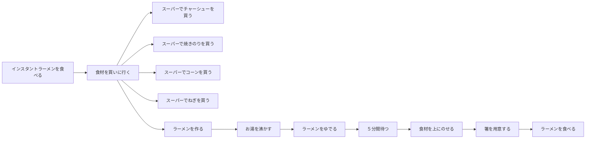

```mermaid  
graph LR

 eating_ramen["インスタントラーメンを食べる"] --> buy_ingredients["食材を買いに行く"]
 buy_ingredients --> buying_ingredients1["スーパーでチャーシューを買う"]
 buy_ingredients --> buying_ingredients2["スーパーで焼きのりを買う"]
 buy_ingredients --> buying_ingredients3["スーパーでコーンを買う"]
 buy_ingredients --> buying_ingredients4["スーパーでねぎを買う"]
 buy_ingredients --> make_ramen["ラーメンを作る"]
 make_ramen --> boil_water["お湯を沸かす"]
 boil_water --> boil_ramen["ラーメンをゆでる"]
 boil_ramen --> wait_time["５分間待つ"]
 wait_time --> on_ingredients["食材を上にのせる"]
 on_ingredients --> prepare_chopsticks["箸を用意する"]
 prepare_chopsticks --> eat_ramen["ラーメンを食べる"]

```