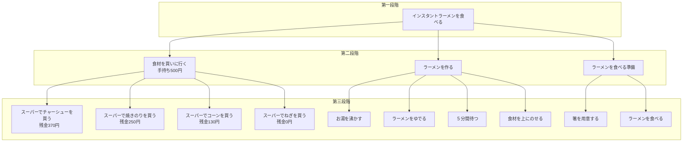

```mermaid  
flowchart TD

subgraph "第一段階"
    eating_ramen[インスタントラーメンを食べる]
end

subgraph "第二段階"
    buy_ingredients[食材を買いに行く
    手持ち500円]
    make_ramen[ラーメンを作る]
    eat_ramen[ラーメンを食べる準備]
end

subgraph "第三段階"
    buying_ingredients1[スーパーでチャーシューを買う
    残金370円]
    buying_ingredients2[スーパーで焼きのりを買う
    残金250円]
    buying_ingredients3[スーパーでコーンを買う
    残金130円]
    buying_ingredients4[スーパーでねぎを買う
    残金0円]

    boil_water[お湯を沸かす]
    boil_ramen[ラーメンをゆでる]
    wait_time[５分間待つ]
    on_ingredients[食材を上にのせる]

    wait_ramen[箸を用意する]
    eat_time[ラーメンを食べる]

end

eating_ramen --> buy_ingredients
eating_ramen --> make_ramen
eating_ramen --> eat_ramen

buy_ingredients --> buying_ingredients1
buy_ingredients --> buying_ingredients2
buy_ingredients --> buying_ingredients3
buy_ingredients --> buying_ingredients4

make_ramen --> boil_water
make_ramen --> boil_ramen
make_ramen --> wait_time
make_ramen --> on_ingredients

eat_ramen --> wait_ramen
eat_ramen --> eat_time

```